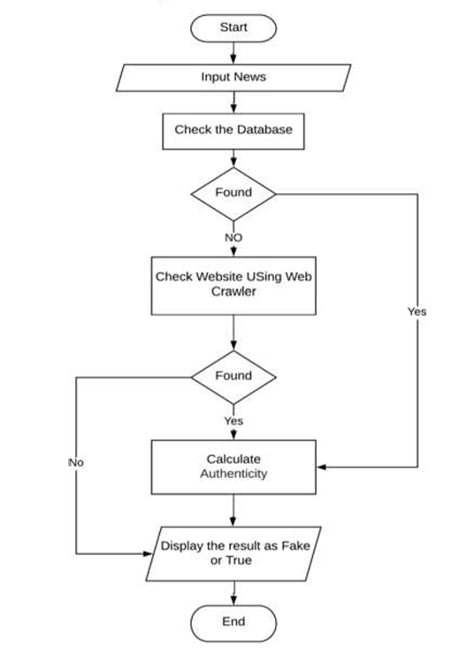
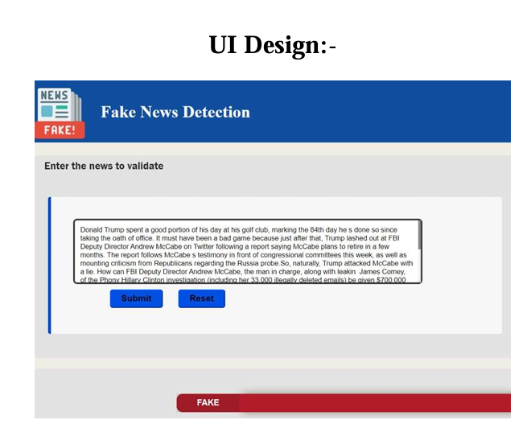

# 📰 Fake News Detection System

<div align="center">


### 🧠 AI-Powered Fake News Detection Using Machine Learning & NLP

</div>

---

## 📌 Project Overview

The rapid growth of digital media has enabled instant access to information across the world. However, this convenience has also led to a serious challenge — the **spread of misinformation and fake news**.

This project focuses on addressing this issue by developing an intelligent **Fake News Detection System** using **Machine Learning (ML)** and **Natural Language Processing (NLP)** techniques.

The system is designed to classify news articles as **real or fake** with high accuracy, helping users verify content authenticity in real time.

---

## 🎯 Project Objectives

The Fake News Detection System is designed with the following core objectives:

### 1. 🧠 Develop an Efficient ML Classification Model
- Implement **Passive Aggressive Classifier**
- Train model for real-time text classification
- Achieve high accuracy in fake news detection

### 2. 🧹 Data Preprocessing & Feature Engineering
- Clean and normalize textual data
- Remove stopwords, punctuation, and noise
- Convert text into numerical features using **TF-IDF Vectorization**

### 3. 🌐 Build User-Friendly Application Interface
- Develop a simple and interactive GUI/Web interface
- Allow users to input news articles easily
- Display real-time prediction results

### 4. ⚡ Optimize Performance & Response Time
- Ensure fast prediction on large text inputs
- Optimize preprocessing pipeline for efficiency
- Enable real-time classification capability

### 5. 🔗 System Integration & Testing
- Integrate ML model with application backend
- Perform testing on real-world datasets
- Validate system accuracy and reliability

---

## 🧠 System Architecture

```text
User Input (News Article)
        ↓
Text Preprocessing
        ↓
TF-IDF Vectorization
        ↓
Passive Aggressive Classifier
        ↓
Prediction Engine
        ↓
Result (REAL / FAKE)
```

---

## 🛠️ Tech Stack

### Programming Language
- Python

### Machine Learning
- Passive Aggressive Classifier
- Scikit-learn
- TF-IDF Vectorizer

### NLP Techniques
- Tokenization
- Stopword Removal
- Text Normalization

### Libraries
- Pandas
- NumPy
- NLTK / spaCy
- Scikit-learn

---

## ✨ Key Features

- 📰 Real-time fake news detection
- 🧠 ML-powered classification engine
- 📊 TF-IDF-based feature extraction
- ⚡ Fast prediction response system
- 🔍 NLP-based text preprocessing pipeline
- 📈 High accuracy classification model
- 💡 Simple and interactive user interface

---

## 📁 Project Structure

```bash
Fake-News-Detection/
│
├── app.py
├── model.pkl
├── vectorizer.pkl
├── train_model.py
├── preprocess.py
├── dataset.csv
└── README.md
```

---

## 🔄 Workflow

1. User enters news text in the application
2. Text is cleaned and preprocessed
3. TF-IDF converts text into numerical vectors
4. Passive Aggressive Classifier predicts output
5. System displays result: **REAL or FAKE**

---

## 📸 Screenshots

### 🏠 Application Interface


### 📊 Prediction Output


---

## 🎯 Applications

- Fake news detection systems
- Social media content verification
- News credibility analysis tools
- Media monitoring platforms
- Digital misinformation control systems

---

## 🚀 Future Enhancements

- 🔥 Deep Learning (LSTM / BERT integration)
- 🌐 Real-time news scraping from websites
- 📱 Mobile application version
- 🌍 Multi-language fake news detection
- ☁️ Cloud deployment (AWS / Azure)
- 🤖 Chrome extension integration

---

## 👨‍💻 Developer

**Ketki Devkar**  
B.E. Artificial Intelligence & Data Science  
GitHub: https://github.com/ketkidevkar

---

⭐ *A step towards combating misinformation using Artificial Intelligence*
